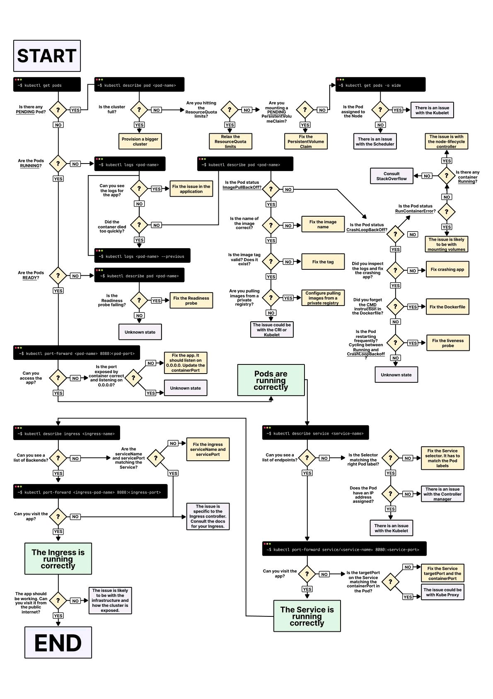

# Kubernetes

## [ConfigMaps and Secrets as volumes](k8s-volumes.md)

## Documentation

- [Kubernetes by example](http://kubernetesbyexample.com/)
- [Istio](https://www.youtube.com/watch?v=s4qasWn_mFc)
- [Scalable microservices with Kubernetes](https://eu.udacity.com/course/scalable-microservices-with-kubernetes--ud615)
- [Kubernetes cheat sheet](https://codefresh.io/kubernetes-tutorial/kubernetes-cheat-sheet/)
- [SkyDNS](https://github.com/skynetservices/skydns)
- [Single master cluster with kubeadm](https://kubernetes.io/docs/setup/independent/create-cluster-kubeadm/)
- [HA Kubernetes cluster on bare metal](https://github.com/salmanb/Kubernetes-HA-on-baremetal)
- [Encryption of Kubernetes persistent local volumes](https://medium.com/@dfrnascimento/encryption-of-kubernetes-persistent-local-volumes-70da62e0ed68)
- [Static provisioner of local volumes](https://github.com/kubernetes-sigs/sig-storage-local-static-provisioner)
- [OpenEBS - Creating and attaching disk on GKE node](https://docs.openebs.io/docs/next/setupstoragepools.html#creating-and-attaching-a-disk-on-gke-node)
- [Kubespray - Deploy a production ready Kubernetes cluster](https://github.com/kubernetes-sigs/kubespray)
- [Ingress basic auth](https://kubernetes.github.io/ingress-nginx/examples/auth/basic/)
- [Generate RBAC policies based on Kubernetes audit logs](https://github.com/liggitt/audit2rbac)
- [Awesome Kubernetes](https://github.com/ramitsurana/awesome-kubernetes)
- [Kubernetes SIG](https://github.com/kubernetes-sigs)
- [12 Kubernetes configuration best practices](https://www.stackrox.com/post/2019/09/12-kubernetes-configuration-best-practices/)
- [Copy files from Kubernetes to S3 and back](https://medium.com/nuvo-group-tech/copy-files-and-directories-between-kubernetes-and-s3-d290ded9a5e0)
- [Kubernetes shared storage with S3 backend](https://icicimov.github.io/blog/virtualization/Kubernetes-shared-storage-with-S3-backend/)
- [Kubernetes Examples - Minimal self-contained examples of standard Kubernetes features and patterns in YAML](https://github.com/ContainerSolutions/kubernetes-examples)
- [AWS Controllers for Kubernetes (ACK) - project enabling you to manage AWS services from Kubernetes](https://github.com/aws/aws-controllers-k8s)

## Blogs

- [Alex Ellis](https://blog.alexellis.io/)
- [IMTI - Architecting, Developing, nixCraft, DevOps, AI/ML, Blockchain](https://imti.co/)
- [Cloud Native Architect Blog](https://cloudowski.com/)
- [Igor Cicimov](https://icicimov.github.io/blog/)

## Debug Pods



## Administration

- [Adding a name or IP to the Kubernetes API Server certificate](https://blog.scottlowe.org/2019/07/30/adding-a-name-to-kubernetes-api-server-certificate/)
- [CORS on Kubernetes Ingress Nginx](https://imti.co/kubernetes-ingress-nginx-cors/)

## Operators

- [Community Operators](https://commons.openshift.org/sig/operators.html)
- [OperatorHub](https://operatorhub.io/)

## Load balancers

[MetalLB - load-balancer implementation for bare metal Kubernetes](https://github.com/metallb/metallb)
[Fabio is a fast, modern, zero-conf load balancing HTTPS and TCP router](https://github.com/fabiolb/fabio)

## Tools

- [Kompose - translate docker-compose files to Kubernetes resources](https://github.com/kubernetes/kompose)
- [kuberhealthy - synthetic testing](https://github.com/Comcast/kuberhealthy)
- [Keel - Kubernetes Operator to automate Helm, DaemonSet, StatefulSet & Deployment updates](https://keel.sh)
- [M3 - Uber’s large-scale metrics platform for Prometheus](https://eng.uber.com/m3/)
- [kubectx & kubens - Switch faster between clusters and namespaces](https://github.com/ahmetb/kubectx)
- [kubeone - Lifecycle management tool for highly available Kubernetes clusters](https://github.com/kubermatic/kubeone)
- [TK8 - Multi-cloud, multi-cluster Kubernetes platform installation and integration tool](https://github.com/kubernauts/tk8)
- [webkubectl - kubectl in web browser](https://github.com/webkubectl/webkubectl)
- [Skbn - tool for copying files and directories between Kubernetes and cloud storage providers](https://github.com/maorfr/skbn)
- [kubenav - desktop and mobile navigator for your Kubernetes clusters](https://github.com/kubenav/kubenav)
- [Kube-Scan - Kubernetes risk assessment tool](https://github.com/octarinesec/kube-scan)
- [Permission Manager is a project that brings sanity to Kubernetes RBAC and Users management](https://github.com/sighupio/permission-manager)
- [KubeCarrier - open source system for managing applications and services across multiple Kubernetes Clusters](https://github.com/kubermatic/kubecarrier)
- [Kubeapps - web-based UI for deploying and managing applications in Kubernetes clusters](https://github.com/kubeapps/kubeapps)
- [Delete stale feature branches in your Kubernetes cluster](https://github.com/dmytrostriletskyi/stale-feature-branch-operator)
- [Kyverno - Kubernetes Native Policy Management](https://github.com/nirmata/kyverno)
- [KubiScan - tool to scan Kubernetes cluster for risky permissions](https://github.com/cyberark/KubiScan)
- [version-checker - Kubernetes utility for observing the current versions of images running in the cluster](https://github.com/jetstack/version-checker)
- [kubeval - tool for validating a Kubernetes YAML file](https://github.com/instrumenta/kubeval)
- [conftest uses the Rego language from Open Policy Agent for writing assertions](https://github.com/open-policy-agent/conftest)
- [KDash - fast and simple CLI dashboard](https://github.com/kdash-rs/kdash)
- [Click - CLI interactive controller made to manage a large number of clusters/objects quickly and efficiently](https://github.com/databricks/click)
- [Submariner - direct networking between pods and services in different clusters](https://github.com/submariner-io/submariner)
- [mirrord - easily mirror traffic from your Kubernetes cluster to your development environment](https://github.com/metalbear-co/mirrord)

## CI & CD

- [Tekton Pipelines](https://github.com/tektoncd/pipeline)
- [Skaffold](https://github.com/GoogleContainerTools/skaffold)
- [How to use Knative Pipelining Component to automate an Application Build and Deployment on Kubernetes](https://itnext.io/how-to-use-knative-pipelining-component-to-automate-an-application-build-and-deployment-on-442b0b1bebf)
- [Build cloud native CI/CD build pipeline from GIT webhook](https://medium.com/@pongsatt/build-cloud-native-ci-cd-build-pipeline-from-git-webhook-9cd9a57a32e1)
- [kontinuous - Kubernetes Continuous Integration & Delivery Platform](https://github.com/AcalephStorage/kontinuous)
- [GitOps with Tekton and ArgoCD](https://github.com/RolandOrg/node-web-app)

## Backup

- [Velero (formerly Ark) - Backup and migrate Kubernetes applications and their persistent volumes](https://github.com/heptio/velero)
- [How To Back Up and Restore Kubernetes Cluster using Ark](https://www.digitalocean.com/community/tutorials/how-to-back-up-and-restore-a-kubernetes-cluster-on-digitalocean-using-heptio-ark)
- [Backup etcd cluster](https://kubernetes.io/docs/tasks/administer-cluster/configure-upgrade-etcd/#backing-up-an-etcd-cluster)

## Courses

- [Ward Viaene - On premise or cloud-agnostic Kubernetes](https://github.com/wardviaene/on-prem-or-cloud-agnostic-kubernetes)
- [Ward Viaene - Kubernetes course](https://github.com/wardviaene/kubernetes-course)

## Helm

- [Helm hub](https://hub.helm.sh/)
- [Charts](https://github.com/helm/charts)
- [Solr](https://github.com/guigo2k/helm-solr)
- [Portus](https://github.com/kubic-project/caasp-services/tree/master/contrib/helm-charts/portus)
- [Plugins](https://docs.helm.sh/related/)
- [Template developer’s guide](https://helm.sh/docs/chart_template_guide/)
- [Helmfile - deploy Kubernetes Helm Charts](https://github.com/roboll/helmfile)
- [helmfile  -  it’s like a Helm for Helm](https://medium.com/@naseem_60378/helmfile-its-like-a-helm-for-your-helm-74a908581599)
- [15+ useful Helm Charts tools](https://caylent.com/15-useful-helm-charts-tools/)
- [ChartMuseum - host your own Helm chart repository](https://github.com/helm/chartmuseum)
- [Using incubator/raw chart](https://github.com/roboll/helmfile/issues/494#issuecomment-474697430)
- [incubator/raw - chart for kubectl declarations](https://github.com/helm/charts/tree/master/incubator/raw)
- [Awesome Helm](https://github.com/cdwv/awesome-helm)
- [Helm Chart starter - better Helm chart boilerplate](https://github.com/sitewards/helm-chart)
- [Creating a better chart](https://medium.com/sitewards/deploying-on-kubernetes-2-scaffolding-6a54e5d181fb)
- [helm-docs - generates automatic documentation from helm charts into a markdown file](https://github.com/norwoodj/helm-docs)
- [Frigate - documentation generation tool for Kubernetes Helm Charts](https://medium.com/rapids-ai/introducing-frigate-a-documentation-generation-tool-for-kubernetes-1791854031a1)
- [How to host your Helm chart repository on GitHub](https://dev.to/jamiemagee/how-to-host-your-helm-chart-repository-on-github-3kd)
- [Using custom domain for GitHub pages](https://medium.com/@hossainkhan/using-custom-domain-for-github-pages-86b303d3918a)
- [kubeval - plugin for validating Helm charts against the Kubernetes schemas using kubeval](https://github.com/instrumenta/helm-kubeval)
- [conftest - plugin for testing Helm charts with Open Policy Agent using conftest](https://github.com/instrumenta/helm-conftest)
- [Chart Releaser](https://github.com/helm/chart-releaser)
- [Chart Releaser GitHub Action](https://github.com/helm/chart-releaser-action)

## Custom Resource Definitions and Development of Kubernetes Applications

- [Accessing Kubernetes CRDs from client-go package](https://www.martin-helmich.de/en/blog/kubernetes-crd-client.html)
- [Extending Kubernetes APIs with Custom Resource Definitions](https://medium.com/velotio-perspectives/extending-kubernetes-apis-with-custom-resource-definitions-crds-139c99ed3477)
- [Unit testing](https://medium.com/@e_frogers/unit-testing-with-kubernetes-client-go-283b11aaa7db)
- [Code Generation for CustomResources](https://blog.openshift.com/kubernetes-deep-dive-code-generation-customresources/)
- [How to generate client codes for Kubernetes Custom Resource Definitions](https://itnext.io/how-to-generate-client-codes-for-kubernetes-custom-resource-definitions-crd-b4b9907769ba)
- [Writing Kubernetes Custom Controllers](https://medium.com/@cloudark/kubernetes-custom-controllers-b6c7d0668fdf)
- [How did that sidecar get there?](https://medium.com/dowjones/how-did-that-sidecar-get-there-4dcd73f1a0a4)
- [k8s-sidecar-injector](https://github.com/tumblr/k8s-sidecar-injector)
- [Controller to manage databases](https://github.com/kubehippie/database-controller)
- [KUDO](https://github.com/kudobuilder/kudo)
- [How to Build a Custom Kubernetes Ingress Controller in Go](http://www.doxsey.net/blog/how-to-build-a-custom-kubernetes-ingress-controller-in-go)
- [Programmatically Kubernetes port forward in Go](https://github.com/gianarb/kube-port-forward)

## Security

- [Kubernetes Security Practices You Should Follow](https://blog.sonatype.com/kubesecops-kubernetes-security-practices-you-should-follow)
- [Sealed Secrets](https://github.com/bitnami-labs/sealed-secrets)
- [Vault](https://www.vaultproject.io/)
- [Advanced Persistence Threats: The Future of Kubernetes Attacks](https://www.youtube.com/watch?v=CH7S5rE3j8w)
- [Rego policies collection](https://github.com/redhat-cop/rego-policies)
- [Kubernetes secrets store CSI driver](https://github.com/kubernetes-sigs/secrets-store-csi-driver/)
- [Prevent access to metadata - AWS](https://docs.aws.amazon.com/AWSEC2/latest/UserGuide/instancedata-data-retrieval.html)
- [Prevent access to metadata - Hetzner Cloud](https://docs.hetzner.cloud/#server-metadata)
- [kube-bench](https://github.com/aquasecurity/kube-bench)
- [Using Kubelet Client to Attack the Kubernetes Cluster](https://www.cyberark.com/resources/threat-research-blog/using-kubelet-client-to-attack-the-kubernetes-cluster)

## Hetzner Cloud

- [Sysctl configuration for high performance](https://gist.github.com/techgaun/958e117b730634fa8128)
- [Installing kubernetes cluster with wireguard](https://propellered.com/posts/kubernetes/)
- [Install a Kubernetes cluster on cloud servers](https://community.hetzner.com/tutorials/install-kubernetes-cluster)
- [Load balancer Helm chart](https://github.com/exocode/helm-charts/tree/master/hetzner-failover-ip)
- [Install hcloud-cloud-controller-manager with network support](https://github.com/hetznercloud/hcloud-cloud-controller-manager/blob/master/docs/deploy_with_networks.md)
- [Creating a single control-plane cluster with kubeadm](https://kubernetes.io/docs/setup/production-environment/tools/kubeadm/create-cluster-kubeadm/)
- [Installing a pod network add-on](https://kubernetes.io/docs/setup/production-environment/tools/kubeadm/create-cluster-kubeadm/#pod-network)
- [Install Cilium](https://cilium.readthedocs.io/en/stable/gettingstarted/k8s-install-default/)
- [IP Address Range](https://ipinfo.io/AS24940)

## kubectl commands

- [Cheat sheet](https://kubernetes.io/docs/reference/kubectl/cheatsheet/)
- [Example commands](kubectl.md)

### Autocomplete

- Turn on autocomplete in the current shell

```sh
source <(kubectl completion bash)
```

- Turn on autocomplete permanently

```sh
echo "source <(kubectl completion bash)" >> ~/.bashrc
```

- Make alias k and autocomplete for it

```sh
alias k=kubectl
complete -F __start_kubectl k
```

## Signing Helm charts

```sh
gpg --gen-key
gpg --export-secret-keys > ~/.gnupg/pubring.gpg
helm package --sign --key 'John Doe' chart
curl -u "username:password" -F "chart=@chart-0.2.7.tgz" -F "prov=@chart-0.2.7.tgz.prov" https://your-charts-repo.domain/api/charts
```

## Use GPG signing key in GitHub Actions

`cat > ~/.gnupg/pubring.gpg | base64 > private.key`

Create GPG_SIGNING_KEY secret in GitHub and paste the contents of the private.key.

Add step:

```yaml
- name: Configure GPG key
  env:
    GPG_SIGNING_KEY: ${{ secrets.GPG_SIGNING_KEY }}
  run: |
    mkdir -p ~/.gnupg/
    printf "${GPG_SIGNING_KEY}" | base64 -d > ~/.gnupg/pubring.gpg
```

You may or may not want to also add the following line:

`gpg --import ~/.gnupg/pubring.gpg`

However, this is not needed for Helm signing.

## CKS

- setup firewall on the instance
- prevent access to instance metadata
- introduce network policy to allow just necessary traffic
- run kube-bench and fix all problems

### Generate TLS certificate

`openssl req -x509 -newkey rsa:4096 -keyout key.pem -out cert.pem -days 365 -nodes`

### Check HTTPS service using fake host

`curl https://secure-ingress.com:31047/service2 -kv --resolve secure-ingress.com:31047:34.105.246.174`

### Disable access to instance metadata

```yaml
apiVersion: networking.k8s.io/v1
kind: NetworkPolicy
metadata:
  name: deny-instance-metadata
spec:
  podSelector: {}
  policyTypes:
    - Egress
  egress:
    - to:
        - ipBlock:
            cidr: 0.0.0.0/0
            except:
              - 169.254.169.254/32
```

### Create user

Create CertificateSigningRequest:

```sh
openssl genrsa -out jane.key 2048
openssl req -new -key jane.key -out jane.csr # set only Common Name = jane

cat <<EOF | kubectl apply -f -
apiVersion: certificates.k8s.io/v1
kind: CertificateSigningRequest
metadata:
  name: jane
spec:
  groups:
  - system:authenticated
  request: $(cat jane.csr | base64 -w 0)
  signerName: kubernetes.io/kube-apiserver-client
  usages:
  - client auth
EOF
```

Configure KUBECONFIG for user jane:

```sh
kubectl config set-credentials jane --client-key=jane.key --client-certificate=jane.crt
kubectl config set-context jane --cluster=kubernetes --user=jane
kubectl config view
kubectl config get-contexts
kubectl config use-context jane
```

### Connect from inside a pod to kube-apiserver

`curl https://kubernetes.default -k -H "Authorization: Bearer $(cat /run/secrets/kubernetes.io/serviceaccount/token)"`

[Disable access](https://kubernetes.io/docs/tasks/configure-pod-container/configure-service-account):

```yaml
apiVersion: v1
kind: ServiceAccount
metadata:
  name: build-robot
automountServiceAccountToken: false
```

or:

```yaml
apiVersion: v1
kind: Pod
metadata:
  name: my-pod
spec:
  serviceAccountName: build-robot
  automountServiceAccountToken: false
```

### Inspect apiserver cert

```sh
cd /etc/kubernetes/pki
openssl x509 -in apiserver.crt -text
```

### [Cluster upgrade](https://kubernetes.io/docs/tasks/administer-cluster/kubeadm/kubeadm-upgrade)

### Allowed websites

- [Docs](https://kubernetes.io/docs/)
- [Source](https://github.com/kubernetes/)
- [Blog](https://kubernetes.io/blog/)
- [Trivy](https://github.com/aquasecurity/trivy)
- [Sysdig](https://docs.sysdig.com/)
- [Falco](https://falco.org/docs/)
- [App Armor](https://gitlab.com/apparmor/apparmor/-/wikis/Documentation)
